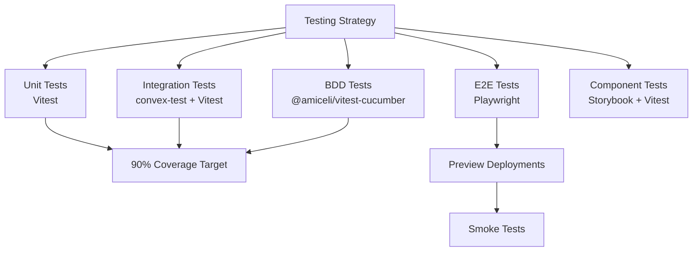

# Complete Testing Guide for get-convex/v1

## ⚠️ Critical Warning About Test Runners

This project uses **Vitest** as its test runner, NOT Bun's built-in test runner. This is extremely important because:

- Bun has its own test runner activated by `bun test`
- Bun's test runner is **incompatible** with our testing setup
- Using `bun test` will break convex-test, @amiceli/vitest-cucumber, and coverage reporting

> Canonical reference: See `AGENTS.md` at the repo root. That document is the single source of truth for test commands, Vitest projects, Turbo tasks, and CI usage. This page summarizes key points and examples.

### Always Use These Commands

```bash
# ✅ CORRECT - Uses Vitest
bun run test              # Executes vitest via package.json script
bunx vitest              # Direct vitest execution
bunx vitest run          # Run once and exit
bunx vitest watch        # Watch mode

# ❌ WRONG - Uses Bun's test runner
bun test                 # NEVER USE THIS
bun test:unit           # NEVER USE THIS (missing 'run')
```

## Testing Architecture Overview



## 1. Unit Testing with Vitest

### Installation

```bash
bun add -D vitest @vitest/ui @vitest/coverage-v8 @testing-library/react @testing-library/user-event
```

### Basic Test Structure

```typescript
// user.service.test.ts
import { describe, it, expect, beforeEach, vi } from 'vitest'
import { UserService } from './user.service'

describe('UserService', () => {
  let service: UserService
  
  beforeEach(() => {
    service = new UserService()
    vi.clearAllMocks()
  })
  
  describe('createUser', () => {
    it('should create a user with valid data', async () => {
      const user = await service.createUser({
        email: 'test@example.com',
        name: 'Test User'
      })
      
      expect(user).toMatchObject({
        email: 'test@example.com',
        name: 'Test User'
      })
      expect(user.id).toBeDefined()
    })
    
    it('should throw on invalid email', async () => {
      await expect(
        service.createUser({ email: 'invalid', name: 'Test' })
      ).rejects.toThrow('Invalid email format')
    })
  })
})
```

### React Component Testing

```typescript
// Button.test.tsx
import { describe, it, expect, vi } from 'vitest'
import { render, screen, fireEvent } from '@testing-library/react'
import { Button } from './Button'

describe('Button', () => {
  it('should render with text', () => {
    render(<Button>Click me</Button>)
    expect(screen.getByRole('button')).toHaveTextContent('Click me')
  })
  
  it('should call onClick handler', async () => {
    const handleClick = vi.fn()
    render(<Button onClick={handleClick}>Click</Button>)
    
    await fireEvent.click(screen.getByRole('button'))
    expect(handleClick).toHaveBeenCalledTimes(1)
  })
})
```

## 2. Integration Testing with convex-test

### Installation

```bash
bun add -D convex-test @edge-runtime/vm
```

### Convex Function Testing

```typescript
// packages/backend/convex/users.test.ts
import { describe, it, expect, beforeEach, vi } from 'vitest'
import { convexTest } from 'convex-test'
import { api, internal } from './_generated/api'
import schema from './schema'

describe('User Convex Functions', () => {
  it('should create and query users', async () => {
    const t = convexTest(schema)
    
    // Create a user
    const userId = await t.mutation(api.users.create, {
      name: 'Alice',
      email: 'alice@example.com'
    })
    
    // Query the user
    const user = await t.query(api.users.getById, { id: userId })
    
    expect(user).toMatchObject({
      name: 'Alice',
      email: 'alice@example.com'
    })
  })
  
  it('should handle authenticated operations', async () => {
    const t = convexTest(schema)
    
    // Create authenticated context
    const alice = t.withIdentity({
      subject: 'alice_123',
      email: 'alice@example.com',
      name: 'Alice'
    })
    
    // Alice creates a private document
    const docId = await alice.mutation(api.documents.createPrivate, {
      title: 'My Private Doc',
      content: 'Secret content'
    })
    
    // Unauthenticated user cannot access
    await expect(
      t.query(api.documents.getById, { id: docId })
    ).rejects.toThrow('Unauthorized')
    
    // Alice can access her document
    const doc = await alice.query(api.documents.getById, { id: docId })
    expect(doc.title).toBe('My Private Doc')
  })
  
  it('should test scheduled functions', async () => {
    vi.useFakeTimers()
    const t = convexTest(schema)
    
    // Schedule a job
    await t.mutation(api.jobs.scheduleReminder, {
      message: 'Remember to test!',
      delayMs: 60000 // 1 minute
    })
    
    // Advance time
    vi.advanceTimersByTime(61000)
    await t.finishAllScheduledFunctions(vi.runAllTimers)
    
    // Check the reminder was sent
    const reminders = await t.query(api.reminders.list)
    expect(reminders).toContainEqual(
      expect.objectContaining({ message: 'Remember to test!' })
    )
    
    vi.useRealTimers()
  })
})
```

### Testing Database Transactions

```typescript
describe('Database Transactions', () => {
  it('should rollback on error', async () => {
    const t = convexTest(schema)
    
    // Attempt transaction that will fail
    await expect(
      t.mutation(api.transactions.transfer, {
        from: 'nonexistent_user',
        to: 'another_user',
        amount: 100
      })
    ).rejects.toThrow()
    
    // Verify no partial changes
    const accounts = await t.query(api.accounts.list)
    expect(accounts).toHaveLength(0)
  })
})
```

## 3. BDD Testing with @amiceli/vitest-cucumber

### Installation

```bash
bun add -D @amiceli/vitest-cucumber
```

### Feature File Example

```gherkin
# apps/app/features/user-onboarding.feature
Feature: User Onboarding
  As a new user
  I want to complete onboarding
  So that I can use the application

  Background:
    Given I am a new user
    And I have verified my email

  Scenario: Complete profile setup
    When I navigate to "/onboarding"
    Then I should see the welcome message
    When I fill in my profile information:
      | field        | value           |
      | displayName  | John Doe        |
      | company      | Acme Corp       |
      | role         | Developer       |
    And I click "Continue"
    Then I should be redirected to "/dashboard"
    And my profile should be saved in Convex

  Scenario: Skip optional fields
    When I navigate to "/onboarding"
    And I click "Skip for now"
    Then I should be redirected to "/dashboard"
    And my profile should have default values
```

### Step Definitions

```typescript
// apps/app/features/steps/onboarding.steps.ts
import { loadFeature, describeFeature } from '@amiceli/vitest-cucumber'
import { convexTest } from 'convex-test'
import { expect } from 'vitest'
import { api } from '@packages/backend/_generated/api'
import schema from '@packages/backend/schema'

const feature = await loadFeature('./features/user-onboarding.feature')

describeFeature(feature, ({ Background, Scenario }) => {
  let t: ReturnType<typeof convexTest>
  let userId: string
  
  Background(({ Given, And }) => {
    Given('I am a new user', () => {
      t = convexTest(schema)
    })
    
    And('I have verified my email', async () => {
      userId = await t.mutation(api.users.create, {
        email: 'test@example.com',
        emailVerified: true
      })
    })
  })
  
  Scenario('Complete profile setup', ({ When, Then, And }) => {
    let response: any
    
    When('I navigate to {string}', (path: string) => {
      // Navigation logic
    })
    
    Then('I should see the welcome message', () => {
      // Assertion logic
    })
    
    When('I fill in my profile information:', async (table: any) => {
      const profileData = table.rows.reduce((acc: any, row: any) => {
        acc[row.field] = row.value
        return acc
      }, {})
      
      await t.mutation(api.users.updateProfile, {
        userId,
        ...profileData
      })
    })
    
    And('my profile should be saved in Convex', async () => {
      const user = await t.query(api.users.getById, { id: userId })
      expect(user.displayName).toBe('John Doe')
      expect(user.company).toBe('Acme Corp')
    })
  })
})
```

## 4. E2E Testing with Playwright

### Installation

```bash
bun add -D @playwright/test
bunx playwright install --with-deps chromium
```

### E2E Test Example

```typescript
// tests/e2e/auth-flow.spec.ts
import { test, expect } from '@playwright/test'

test.describe('Authentication Flow', () => {
  test('should sign up new user', async ({ page }) => {
    await page.goto('/signup')
    
    // Fill signup form
    await page.fill('[data-testid="email-input"]', 'newuser@example.com')
    await page.fill('[data-testid="password-input"]', 'SecurePass123!')
    await page.fill('[data-testid="confirm-password"]', 'SecurePass123!')
    
    // Submit form
    await page.click('[data-testid="signup-button"]')
    
    // Wait for redirect
    await page.waitForURL('/verify-email')
    
    // Check success message
    await expect(page.locator('[data-testid="verify-message"]')).toContainText(
      'Please check your email'
    )
  })
  
  test('should handle login errors', async ({ page }) => {
    await page.goto('/login')
    
    // Try invalid credentials
    await page.fill('[data-testid="email-input"]', 'wrong@example.com')
    await page.fill('[data-testid="password-input"]', 'wrongpass')
    await page.click('[data-testid="login-button"]')
    
    // Check error message
    await expect(page.locator('[data-testid="error-message"]')).toBeVisible()
    await expect(page.locator('[data-testid="error-message"]')).toContainText(
      'Invalid credentials'
    )
  })
})
```

### Page Object Model

```typescript
// tests/e2e/pages/LoginPage.ts
import { Page, Locator } from '@playwright/test'

export class LoginPage {
  readonly page: Page
  readonly emailInput: Locator
  readonly passwordInput: Locator
  readonly loginButton: Locator
  readonly errorMessage: Locator
  
  constructor(page: Page) {
    this.page = page
    this.emailInput = page.locator('[data-testid="email-input"]')
    this.passwordInput = page.locator('[data-testid="password-input"]')
    this.loginButton = page.locator('[data-testid="login-button"]')
    this.errorMessage = page.locator('[data-testid="error-message"]')
  }
  
  async goto() {
    await this.page.goto('/login')
  }
  
  async login(email: string, password: string) {
    await this.emailInput.fill(email)
    await this.passwordInput.fill(password)
    await this.loginButton.click()
  }
  
  async getErrorMessage() {
    return this.errorMessage.textContent()
  }
}
```

## 5. Component Testing with Storybook

### Installation

```bash
bunx storybook@latest init
bun add -D @storybook/addon-vitest @storybook/addon-coverage
```

### Story with Tests

```typescript
// packages/ui/src/components/Button.stories.tsx
import type { Meta, StoryObj } from '@storybook/react'
import { within, userEvent, expect } from '@storybook/test'
import { Button } from './Button'

const meta: Meta<typeof Button> = {
  title: 'Components/Button',
  component: Button,
  parameters: {
    layout: 'centered',
  },
  tags: ['autodocs'],
  argTypes: {
    variant: {
      control: 'select',
      options: ['primary', 'secondary', 'danger']
    }
  }
}

export default meta
type Story = StoryObj<typeof meta>

export const Primary: Story = {
  args: {
    variant: 'primary',
    children: 'Click me',
  },
  play: async ({ canvasElement }) => {
    const canvas = within(canvasElement)
    const button = canvas.getByRole('button')
    
    // Test interactions
    await expect(button).toBeInTheDocument()
    await expect(button).toHaveTextContent('Click me')
    
    await userEvent.click(button)
    // Add more interaction tests
  }
}

export const Loading: Story = {
  args: {
    loading: true,
    children: 'Loading...',
  },
  play: async ({ canvasElement }) => {
    const canvas = within(canvasElement)
    const button = canvas.getByRole('button')
    
    await expect(button).toBeDisabled()
    await expect(canvas.getByTestId('spinner')).toBeInTheDocument()
  }
}
```

## Package.json Configuration

### Root package.json

```json
{
  "name": "@repo/root",
  "private": true,
  "scripts": {
    "dev": "turbo run dev",
    "build": "turbo run build",
    "test": "vitest",
    "test:run": "vitest run",
  "test:unit": "vitest run --project unit",
  "test:integration": "bun -C packages/backend run test",
    "test:bdd": "vitest run --config vitest.bdd.config.ts",
    "test:watch": "vitest watch",
    "test:ui": "vitest --ui",
    "test:coverage": "vitest run --coverage",
    "test:e2e": "playwright test",
    "test:e2e:debug": "playwright test --debug",
    "test:e2e:ui": "playwright test --ui",
    "test:storybook": "test-storybook",
    "test:all": "turbo run test:coverage test:e2e --parallel",
    "test:smoke": "playwright test tests/smoke --reporter=dot",
    "storybook": "storybook dev -p 6006",
    "build-storybook": "storybook build"
  },
  "devDependencies": {
    "vitest": "^2.0.0",
    "@vitest/ui": "^2.0.0",
    "@vitest/coverage-v8": "^2.0.0",
    "@playwright/test": "^1.48.0",
    "@amiceli/vitest-cucumber": "^5.1.2",
    "convex-test": "^0.0.30"
  }
}
```

### Package-level package.json

```json
{
  "name": "@packages/backend",
  "scripts": {
    "test": "vitest run",
    "test:watch": "vitest watch",
    "test:coverage": "vitest run --coverage"
  }
}
```

## GitHub Actions Workflow

```yaml
name: Test Suite
on:
  push:
    branches: [main]
  pull_request:

jobs:
  test:
    runs-on: ubuntu-latest
    steps:
      - uses: actions/checkout@v4
      - uses: oven-sh/setup-bun@v2
        with:
          bun-version: latest
      
      - name: Install dependencies
        run: bun install --frozen-lockfile
      
      - name: Run unit tests with coverage
        run: bun run test:coverage  # Uses vitest, NOT bun test
      
      - name: Upload coverage
        uses: codecov/codecov-action@v4
        with:
          files: ./coverage/coverage-final.json
          flags: unit
          token: ${{ secrets.CODECOV_TOKEN }}
  
  e2e:
    runs-on: ubuntu-latest
    steps:
      - uses: actions/checkout@v4
      - uses: oven-sh/setup-bun@v2
      
      - name: Install dependencies
        run: |
          bun install --frozen-lockfile
          bunx playwright install --with-deps chromium
      
      - name: Build application
        run: bun run build
      
      - name: Run E2E tests
        run: bun run test:e2e  # Uses playwright
      
      - uses: actions/upload-artifact@v4
        if: always()
        with:
          name: playwright-report
          path: playwright-report/

## Common Issues and Solutions

### Issue: Tests not running

```bash
# Wrong - uses Bun's test runner
bun test

# Correct - uses Vitest
bun run test
# or
bunx vitest
```

### Issue: Coverage not working

```bash
# Ensure coverage reporter is installed
bun add -D @vitest/coverage-v8

# Run with coverage
bun run test:coverage
```

### Issue: Convex-test not working

```bash
# Install required dependencies
bun add -D convex-test @edge-runtime/vm

# Ensure vitest config includes:
test: {
  deps: {
    inline: ['convex-test']
  }
}
```

### Issue: Import errors in tests

```typescript
// vitest.config.ts
export default defineConfig({
  resolve: {
    alias: {
      '@': path.resolve(__dirname, './src'),
      '@packages': path.resolve(__dirname, './packages')
    }
  }
})
```

## Testing Checklist

- [ ] All packages have vitest configured
- [ ] Package.json scripts use vitest, not bun test
- [ ] 90% code coverage threshold set
- [ ] Convex functions have integration tests
- [ ] Critical user paths have E2E tests
- [ ] BDD features for user journeys
- [ ] Components have Storybook stories
- [ ] CI/CD runs all test suites
- [ ] Preview deployments have smoke tests
- [ ] Test data is properly isolated
- [ ] Mocks are cleaned up after tests

## Resources

- [Vitest Documentation](https://vitest.dev)
- [Playwright Documentation](https://playwright.dev)
- [convex-test Documentation](https://docs.convex.dev/testing/convex-test)
- [@amiceli/vitest-cucumber](https://vitest-cucumber.miceli.click/)
- [Storybook Documentation](https://storybook.js.org)
